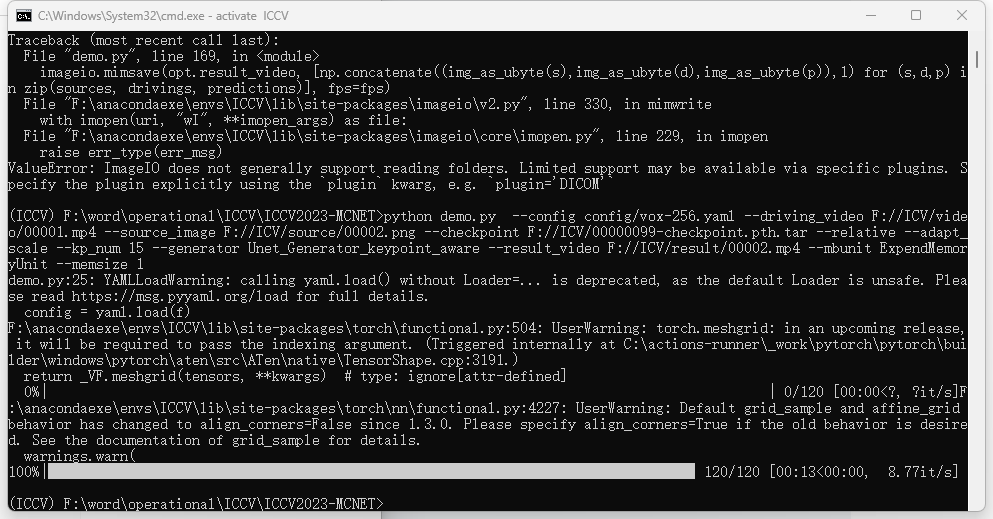
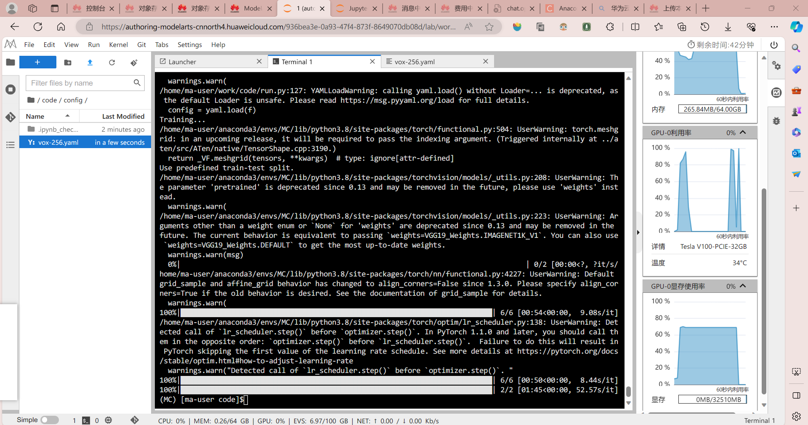

# 1. 完成的功能

##  1.1 模型 Pre-trained checkpoint 跑通

​      本项目中有训练好的 *checkpoint* ，装载参数后使用一个 *driving video* 和一个 *source image* 作为输入，可以生成一个合成的结果视频。同时，在我们小组训练之后，得到的模型也可以在环境内跑通。

##  1.2 模型 Training 跑通

​       本项目提供了两个选项，一个是在 *voxceleb* 数据集上训练，另一个是利用自己的数据集训练。由于存储空间有限，我们小组暂时没有条件在 *voxceleb* 数据集上训练，因此在本次作业中我们选择自行制作数据集进行训练。最终我们修改超参数，利用自己制作的数据集跑通了训练的部分。

# 2. 实验环境

​       按照老师的要求，创建conda环境，python=3.8，torch==1.13.1+cu116，其他的库（全）的版本如下：

absl-py==1.0.0
certifi==2021.10.8
cycler==0.11.0
einops
fonttools==4.33.2
grpcio==1.44.0
huaweicloudsdkcore==3.1.8
imageio==2.17.0
imageio-ffmpeg
importlib-metadata==4.11.3
joblib==1.1.0
lpips
kiwisolver==1.4.2
Markdown==3.3.6
matplotlib==3.5.2
networkx==2.6.3
numpy==1.21.6
opencv-python
packaging==21.3
pandas==1.3.5
Pillow==9.5.0
protobuf==3.20.1
pyparsing==3.0.8
python-dateutil==2.8.2
pytz==2022.1
PyWavelets==1.3.0
PyYAML==5.4.1
scikit-image==0.16.2
scikit-learn==1.0.2
scipy==1.7.3
six==1.16.0
sklearn==0.0
tenacity==8.2.2
tensorboard==1.15.0
threadpoolctl==3.1.0
tifffile==2021.11.2
torchdiffeq
torchvision
tqdm==4.65.0
typing-extensions<=4.0.1
Werkzeug==2.1.1
zipp==3.8.0

注：对于 *checkpoint* ，可以直接在windows中跑通；对于 *training* 的部分，关于单GPU训练的代码，本小组进行了部分的修改，但是工程量较大，尚未完成，有待更新，但是可以使用华为云，在分布式系统中跑通。

# 3. 验证截图

##  3.1 Pre-trained checkpoint 跑通

  

结果如下：

  

##  3.2 跑通 training

  

# 4. 成员分工

​      我们小组的成员有5人。陈裕博和李宇硕负责在 *windows* 上配置虚拟环境，跑通模型 *checkpoint* ，并修改训练代码为单 GPU 训练模式；齐子豪和张易从负责 *linux* 版本环境配置、华为云的学习和训练代码的修改跑通；李锡负责数据集的制作和抽帧，以及模型 *checkpoint* 的跑通。作为组长，陈裕博还负责了总体的任务安排以及与助教老师和组员沟通的任务。

 